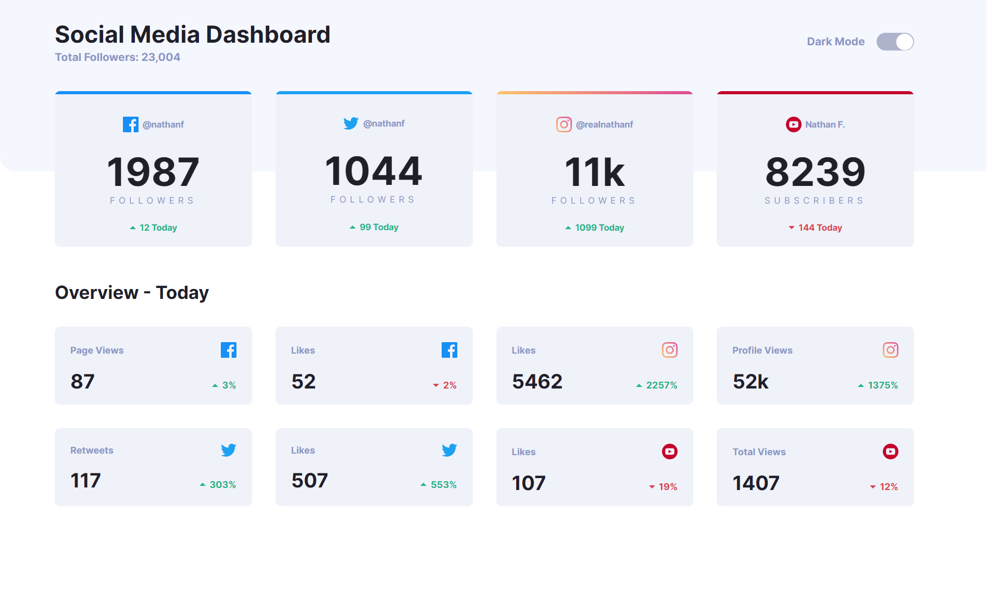
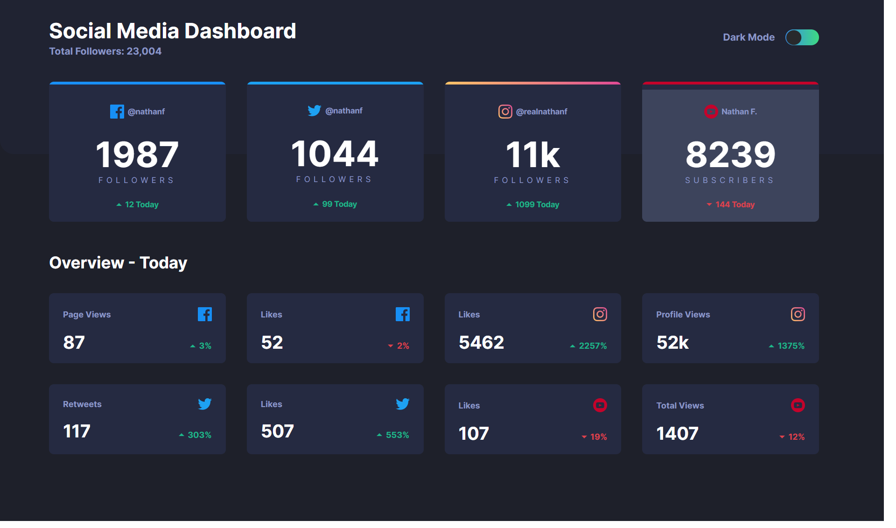

# Frontend mentor - Social media dashboard with theme switcher solution

This is a solution to the [Social media dashboard with theme switcher challenge on Frontend Mentor](https://www.frontendmentor.io/challenges/social-media-dashboard-with-theme-switcher-6oY8ozp_H). Frontend Mentor challenges help you improve your coding skills by building realistic projects.

## Table of Contents

* [Overview](#overview)
    * [The challenge](#the-challenge)
    * [Screenshot](#screenshot)
    * [Links](#links)
* [My process](#my-process)
    * [Built with](#built-with)
    * [What I learned](#what-i-learned)
    * [Useful resources](#useful-resources)
* [Author](#author)

## Overview
---
### The challenge

Users should be able to:

* View the optimal layout for the site depending on their device's screen sizes
* See hover states for all interactive elements on the page
* Toggle color theme to their preference

### Screenshot
    
#### Light Theme



#### Dark Theme



### Links
* Solution URL: [Github Page](https://github.com/DineshrajAnandan/FrontEndMentorChallenges/tree/main/social-media-dashboard-with-theme-switcher)
* Live URL: [Netlify](https://astounding-paprenjak-a7e1d0.netlify.app)

## My process
---

### Built with
* Semantic HTML5 markup
* CSS custom properties
* CSS Flexbox
* CSS Grid
* Mobile-first workflow
* Javascript - for theme changing

### What I learned

I learnt more on how to use CSS flexbox and grid to build responsive layouts. I also learnt some new CSS animation properties
```css
.class-name {
    display: grid;
    gap: 20px;
    grid-template-columns: repeat(2, 1fr); 
}
```

### Useful resources

* [A complete guide to CSS flexbox by CSS Tricks](https://css-tricks.com/snippets/css/a-guide-to-flexbox/)

* [A complete guide to CSS grid by CSS Tricks](https://css-tricks.com/snippets/css/complete-guide-grid/)


## Author
---

* Frontend Mentor - [@darnnie21](https://www.frontendmentor.io/profile/darnnie21)

* LinkedIn - [Daniel Ubah](https://www.linkedin.com/in/daniel-ubah-558178219/)
